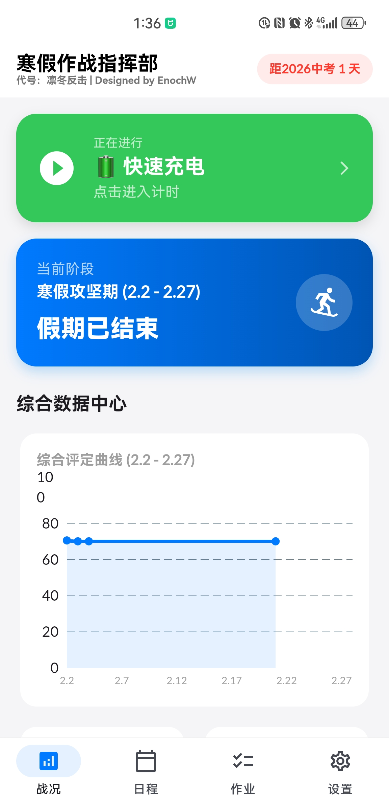
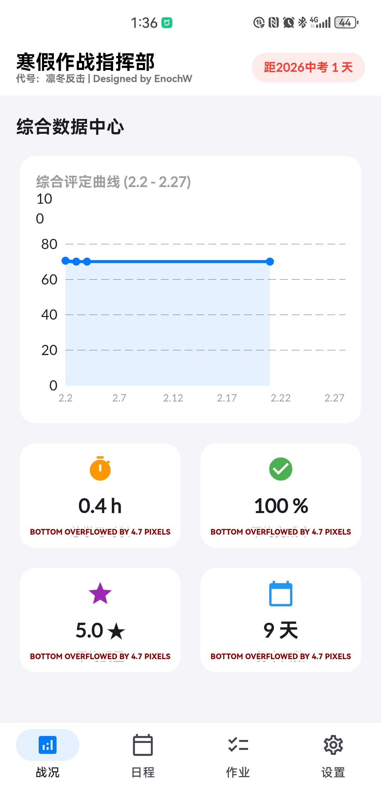
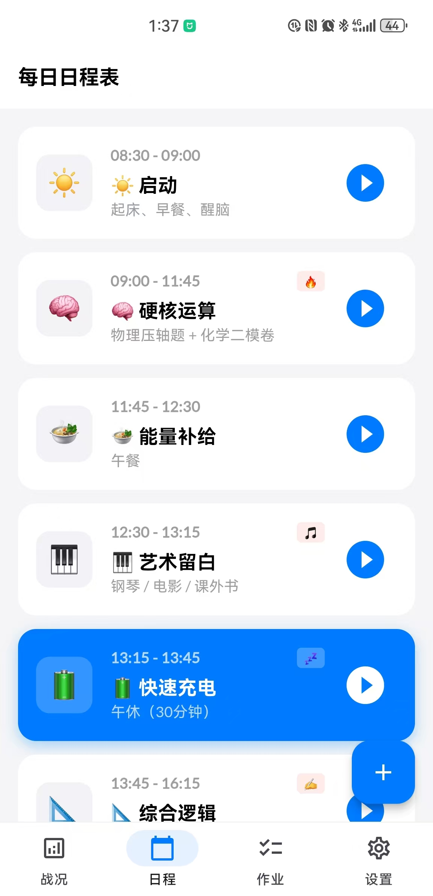
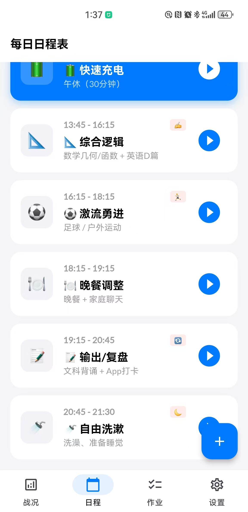
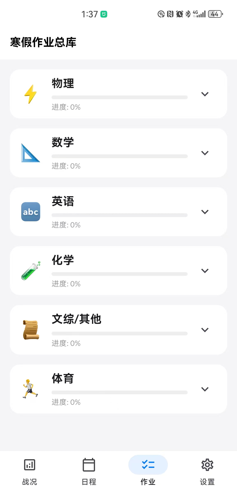
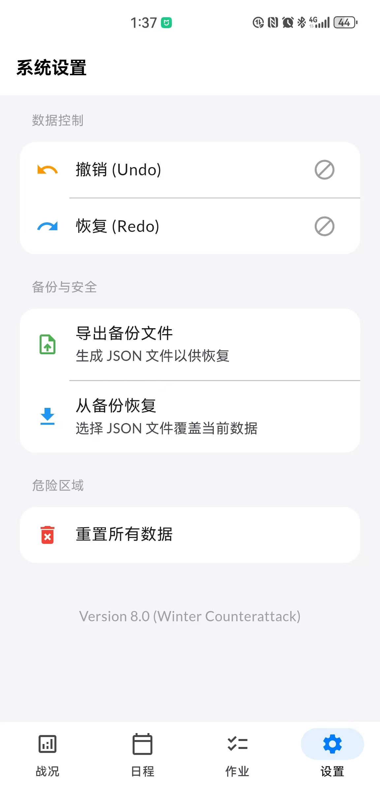

# WinterPlan 寒假作战指挥部

WinterPlan 是一个面向寒假学习冲刺场景的 Flutter 手机应用。它把“每天应该做什么”“作业完成到哪里”“当前任务还剩多久”“今天投入了多少时间”“整体复盘曲线怎么样”集中到一个移动端界面里，帮助学生和家长把松散的寒假计划变成可以执行、可以打卡、可以复盘的数据化流程。

应用当前代号为“凛冬反击”，界面中使用“寒假作战指挥部”“每日日程表”“寒假作业总库”“系统设置”四个主要入口。项目默认内置一份寒假学习计划和作业库，也支持用户在手机端继续编辑、添加、打卡、备份和恢复。

## 项目简介

为了保留项目从原型到手机应用的完整演进，本仓库现在包含两个阶段的实现：

- `WinterPlan/`：旧版 Python + Streamlit 网页原型。它用于快速验证寒假学习计划的数据结构、任务管理、动态目标计算、打卡记录和 JSON 本地存储，适合在电脑浏览器中运行和调试，但不能直接打包成 Android APK。
- 仓库根目录：当前 Flutter 手机 App 版。`lib/`、`android/`、`pubspec.yaml` 等文件组成现在用于本地安装和 APK 打包的正式移动端实现，它继承了旧版原型的学习计划逻辑，并重新实现为离线可用的手机应用。

因此，`WinterPlan/` 的作用是保留旧版网页原型和早期数据来源；真正执行 `flutter build apk` 的项目仍然是当前仓库根目录下的 Flutter 工程。

寒假学习最容易遇到的问题不是“没有计划”，而是计划落地以后缺少一个低摩擦的执行系统：

- 纸面计划难以及时知道现在该做哪一项。
- 作业清单分散在老师通知、纸质资料、群消息和家长记录中，很难汇总进度。
- 学习时长、完成率和学习质量通常只靠感觉判断，缺少持续记录。
- 家长或学生想调整计划时，没有撤销、备份和恢复机制，容易越改越乱。
- 一天结束后很难回答“今天到底完成了多少”“哪几天状态好”“寒假整体有没有推进”。

WinterPlan 解决的是“寒假计划从静态清单到动态执行”的问题。它把日程、计时、作业、打卡和数据看板整合在同一个 App 中：

- 日程负责回答“现在做什么”。
- 计时负责记录“做了多久”。
- 作业库负责回答“哪些任务完成了”。
- 打卡结算负责记录“完成度和质量如何”。
- 数据中心负责回答“阶段表现如何变化”。
- 备份恢复负责保证数据可以迁移和兜底。

这个项目不是通用日历，也不是简单 Todo List。它更像一个面向中考寒假冲刺的个人学习作战台：默认计划围绕 2026 中考、2.2 到 2.27 寒假攻坚期、每日固定学习节奏和六类作业库展开，强调执行、反馈和复盘。

## WinterPlan 目录源码说明

`WinterPlan/` 是本项目的旧版 Python + Streamlit 网页原型源码目录。它的核心价值不是打包 APK，而是保留项目最早的功能验证过程：先用 Python 快速做出可运行的网页版学习计划工具，验证“任务清单、每日目标、打卡记录、进度统计、撤销恢复、JSON 存储”这些业务逻辑是否成立，再把已经验证过的思路迁移到 Flutter 手机 App 中。

简单说，`WinterPlan/` 回答的是“这个学习计划系统最早是如何被设计和验证的”；仓库根目录的 Flutter 工程回答的是“这个系统如何变成可以安装到手机上的 App”。

### 目录定位

`WinterPlan/` 主要承担四个作用：

- 原型验证：用 Streamlit 快速搭建网页界面，验证寒假学习计划是否适合用数据化方式管理。
- 业务逻辑沉淀：保留每日目标计算、任务完成率、学习时长记录、自评分、撤销恢复和备份等早期实现。
- 数据来源说明：保留旧版 JSON 数据文件，展示早期计划、任务和打卡数据的组织方式。
- 项目演进证据：说明当前 Flutter App 不是凭空生成的界面，而是从一个可运行的 Python 网页原型迭代而来。

这个目录不参与 Android 打包。执行 `flutter build apk` 时，Flutter 只会使用根目录下的 `lib/`、`android/`、`pubspec.yaml` 等 Flutter 工程文件。

### 主要源码文件

`WinterPlan/` 中有多个版本文件，这是因为旧版原型经历了从简单版到增强版、再到模块化 Pro 版的迭代。

| 文件 | 作用 |
| --- | --- |
| `winter_plan_app.py` | 早期基础版 Streamlit 应用，包含默认任务、JSON 读写、每日目标计算和基础进度展示。 |
| `winter_plan_enhanced.py` | 增强版原型，在基础版上加入更完整的数据结构、进度统计和重置能力。 |
| `winter_plan_final.py` | 单文件整合版，保留较完整的任务配置、迁移逻辑、数据保存和界面展示。 |
| `winter_plan_pro.py` | Pro 单文件版本，加入撤销/恢复、历史记录、自评分、备份和更丰富的可视化能力。 |
| `winter_plan_pro_main.py` | Pro 模块化版本的主入口，负责组合数据逻辑和 UI 组件，是阅读旧版原型时最推荐的入口。 |
| `data_logic.py` | Pro 模块化版本的数据和业务逻辑层，包含默认计划、时间表、JSON 加载保存、格式迁移、进度计算、历史记录、任务增删改和计时记录。 |
| `ui_view.py` | Pro 模块化版本的 Streamlit 界面层，包含页面设置、侧边栏、撤销恢复、数据导出、任务管理、时间表和打卡视图。 |
| `app.py` | 另一版 Streamlit 实验入口，使用 `enoch_study_data.json`，包含任务管理、Session State、撤销和评分逻辑。 |

如果只是想了解旧版原型的核心设计，优先阅读这三个文件：

```text
WinterPlan/winter_plan_pro_main.py
WinterPlan/data_logic.py
WinterPlan/ui_view.py
```

### 启动脚本和测试文件

旧版原型还保留了若干启动脚本，方便在不同环境下运行：

| 文件 | 作用 |
| --- | --- |
| `start_app.py` | 检查依赖并启动早期 Streamlit 应用。 |
| `start_app_high_port.py` | 使用较高端口启动，主要用于规避 Windows 端口权限问题。 |
| `start_enhanced_app.py` | 启动增强版原型。 |
| `start_final_app.py` | 启动 final 单文件版本。 |
| `start_pro_app.py` | 启动 Pro 版本。 |
| `run_app.bat` / `run_app_simple.bat` | Windows 下双击运行的批处理脚本。 |
| `test_app.py` / `test_enhanced_app.py` | 旧版原型的轻量测试脚本，用来检查数据结构、计算函数、备份系统和运行环境。 |

### JSON 数据文件

`WinterPlan/` 中的 JSON 文件是旧版 Streamlit 原型的数据文件，不是当前 Flutter App 运行时直接读取的数据。

| 文件 | 作用 |
| --- | --- |
| `my_study_plan.json` | 早期基础版/增强版使用的学习计划数据。 |
| `my_study_plan_pro.json` | Pro 版本使用的数据文件，结构更接近完整任务管理系统。 |
| `enoch_study_data.json` | `app.py` 实验入口使用的数据文件。 |
| `backups/backup_20260130.json` | 旧版原型生成的数据备份样例。 |

这些文件展示了早期数据如何从“任务总量、已完成量、单位、图标”逐步扩展到“任务模块、自评分、时间记录、历史记录和每日评分”。当前 Flutter App 没有直接复用这些 JSON 文件，而是把类似的数据结构重新实现到了 Dart 模型和 `SharedPreferences` 本地存储中。

### 与 Flutter App 的关系

旧版 Streamlit 原型和当前 Flutter App 的关系可以理解为：

```text
Python/Streamlit 原型
  -> 验证学习计划、打卡、统计、备份这些业务逻辑
  -> 沉淀默认任务、时间安排和 JSON 数据结构
  -> 迁移为 Flutter/Dart 手机端实现
  -> 通过 Android 工程打包为 APK
```

两者不是重复项目，而是同一个项目的两个阶段。`WinterPlan/` 更适合展示“需求探索和原型验证”；Flutter 工程更适合展示“移动端产品化和本地安装”。因此 README 中同时保留两者，可以让读者清楚看到项目从网页原型到手机 App 的完整过程。

## 项目功能点

### 1. 战况总览

战况页是应用首页，用来快速查看当前状态。

- 顶部显示“寒假作战指挥部”和中考倒计时。
- 自动根据当前时间匹配正在进行的日程项或下一项任务。
- 当前任务卡片可以一键进入计时页。
- 显示寒假攻坚阶段信息，例如 2.2 到 2.27 的阶段范围。
- 综合数据中心展示 2.2 到 2.27 的综合评定曲线。
- 统计卡片汇总总学习时长、平均完成率、平均质量和打卡天数。

综合评定曲线由本地打卡日志生成。每次完成任务后，App 会根据投入时长、完成度和质量自评计算当天得分，并把这些得分绘制成折线图。

### 2. 每日日程表

日程页展示一天从早到晚的安排。默认计划包括启动、硬核运算、能量补给、艺术留白、快速充电、综合逻辑、激流勇进、晚餐调整、输出复盘和自由洗漱等任务块。

每个日程项包含：

- 时间段，例如 `09:00 - 11:45`。
- 模块名称，例如“硬核运算”。
- 具体内容，例如“物理压轴题 + 化学二模卷”。
- Emoji 图标，用于快速识别任务类型。
- 标签，例如重点任务、休息、运动等视觉提示。

日程页支持：

- 自动高亮当前时间正在进行的任务。
- 点击任务进入计时页面。
- 点击卡片编辑已有任务。
- 通过右下角加号新增日程。
- 保存后按时间段排序。

### 3. 专注计时与任务结算

计时页用于把计划转化为实际投入。

- 进入某个日程任务后，App 会根据该任务的结束时间计算剩余专注时间。
- 如果任务已经超过计划结束时间，会进入超时显示，提醒用户加紧收尾。
- 点击“完成并打卡”后进入任务结算。
- 结算时记录本次投入分钟数。
- 用户可以填写完成度，范围支持 0% 到 150%，用于表示超额完成。
- 用户可以用 1 到 5 星进行质量自评。

打卡得分逻辑：

- 时长得分：以 360 分钟为满分 30 分基准，超出部分按较低权重加分。
- 进度得分：完成度按 40 分计算。
- 质量得分：五星质量按 30 分计算。
- 综合分最高封顶 100 分。

如果同一天多次打卡，App 会累加学习分钟数，并对综合分、完成率和质量分做平均更新。

### 4. 寒假作业总库

作业页以学科为单位管理寒假任务。

默认分类包括：

- 物理
- 数学
- 英语
- 化学
- 文综/其他
- 体育

每个学科卡片显示：

- 学科图标。
- 学科名称。
- 当前进度百分比。
- 进度条。
- 可展开的作业条目列表。

作业库支持：

- 勾选完成或取消完成。
- 自动计算每个学科完成进度。
- 添加新的作业条目。
- 删除已有条目。
- 已完成条目显示删除线。

默认数据直接写在 `lib/main.dart` 的初始化逻辑里。首次启动时，如果本机没有历史数据，App 会写入默认日程和默认作业库；一旦用户修改，后续会优先读取本机保存的数据。

### 5. 数据控制、撤销恢复与备份

设置页提供数据安全能力。

- 撤销 Undo：对日程、作业和日志修改前保存快照，最多保留 20 步。
- 恢复 Redo：撤销后可以恢复到下一步。
- 导出备份文件：生成 JSON 文件，并通过系统分享面板导出。
- 从备份恢复：选择 JSON 文件覆盖当前数据。
- 重置所有数据：清空本机保存的数据，回到默认初始化状态。

备份内容包含三类核心数据：

- `schedule`：日程安排。
- `homeworks`：作业库和完成状态。
- `logs`：每日打卡日志。

## 技术实现

### 技术栈

项目使用 Flutter 实现，主要依赖如下：

| 类型 | 工具/库 | 作用 |
| --- | --- | --- |
| 跨端框架 | Flutter | 构建 Android、iOS、Web、桌面端界面 |
| 语言 | Dart | 应用逻辑、数据模型和 UI 实现 |
| 状态管理 | provider | 管理全局 AppState，并驱动界面刷新 |
| 本地存储 | shared_preferences | 保存日程、作业和日志 JSON 数据 |
| 图表 | fl_chart | 绘制综合评定折线图 |
| 日期格式化 | intl | 格式化日期、备份文件名和日志日期 |
| 字体 | google_fonts | 使用 Lato、Roboto Mono 等字体样式 |
| 文件路径 | path_provider | 获取临时目录用于生成备份文件 |
| 分享 | share_plus | 分享导出的 JSON 备份 |
| 文件选择 | file_picker | 选择 JSON 备份文件并恢复 |

### 数据模型

核心数据模型在 `lib/main.dart` 中：

- `ScheduleItem`：日程项，包含时间段、标题、内容、图标和标签。
- `HomeworkItem`：单条作业，包含内容和完成状态。
- `SubjectHomework`：学科作业组，包含学科名、图标和作业列表，并计算完成进度。
- `DailyLog`：每日打卡日志，包含日期、综合分、分钟数、完成率和质量评分。
- `AppState`：全局状态容器，负责初始化、保存、撤销、恢复、备份、导入和通知 UI 刷新。

### 数据从哪里来

当前 Flutter App 运行时的数据来源主要分为两类，仓库中还保留了一组旧版原型数据作为项目演进说明。

第一类是默认内置数据。首次启动时，如果本地没有存储过数据，App 会使用代码中预置的日程和作业清单。默认日程覆盖一天中学习、休息、运动、复盘和睡前整理的完整节奏。默认作业库覆盖物理、数学、英语、化学、文综/其他和体育六类任务。

第二类是用户使用过程中产生的数据。用户编辑日程、勾选作业、添加作业、打卡结算后，App 会把数据序列化成 JSON 字符串并保存到 `SharedPreferences`。对应 key 包括：

- `schedule_v8`
- `homework_v8`
- `logs_v8`

这意味着 App 默认是离线可用的，不依赖服务器，也不会把学习数据上传到云端。备份和迁移通过用户主动导出的 JSON 文件完成。

此外，`WinterPlan/` 目录中保留了旧版 Streamlit 原型使用过的 JSON 数据，例如 `enoch_study_data.json`、`my_study_plan.json` 和 `my_study_plan_pro.json`。这些文件不是 Flutter App 启动时直接读取的数据源，而是用于展示早期网页版原型如何组织学习任务、进度和打卡记录。

### 程序如何实现

应用启动后，`main()` 使用 `ChangeNotifierProvider` 创建 `AppState`，所有页面通过 `context.watch<AppState>()` 或 `context.read<AppState>()` 读取和修改状态。

启动流程：

1. `AppState._init()` 读取 `SharedPreferences`。
2. 如果存在历史 JSON，则反序列化恢复日程、作业和日志。
3. 如果不存在历史 JSON，则加载默认日程和默认作业库。
4. 调用 `notifyListeners()` 刷新页面。

修改流程：

1. 用户执行勾选、添加、编辑、打卡等操作。
2. 修改前调用 `_saveSnapshot()` 保存撤销快照。
3. 更新内存中的 `schedule`、`homeworks` 或 `logs`。
4. 调用 `_persist()` 写入 `SharedPreferences`。
5. `provider` 通知界面自动刷新。

打卡流程：

1. 用户从日程页或首页进入 `TimerPage`。
2. `TimerPage` 用 `Timer.periodic` 每秒更新计时状态。
3. 用户点击“完成并打卡”后打开 `SubmitSheet`。
4. 用户填写完成度和质量自评。
5. `submitLog()` 根据分钟数、完成度和星级计算综合分。
6. 当天已有日志时合并更新，没有日志时新增 `DailyLog`。

图表流程：

1. 战况页读取 `logs`。
2. 以 2026-02-02 到 2026-02-27 为横轴范围。
3. 将有日志的日期转换成 `FlSpot`。
4. 使用 `fl_chart` 绘制综合评定曲线。

## App 截图

| 战况总览与当前任务 | 综合数据中心与统计卡片 |
| --- | --- |
|  |  |

| 每日日程表 - 上午与当前任务 | 每日日程表 - 下午与晚上 |
| --- | --- |
|  |  |

| 寒假作业总库 | 系统设置与备份恢复 |
| --- | --- |
|  |  |

## 项目结构

```text
.
├── WinterPlan/                    # 旧版 Python + Streamlit 网页原型
│   ├── app.py                     # 旧版原型入口之一
│   ├── winter_plan_app.py         # 早期 Streamlit 主应用
│   ├── winter_plan_pro.py         # 增强版原型
│   ├── requirements.txt           # 旧版 Python 依赖
│   ├── *.json                     # 旧版计划数据和打卡数据
│   └── backups/                   # 旧版数据备份样例
├── lib/
│   └── main.dart                  # 主要应用逻辑、数据模型、状态管理和 UI 页面
├── android/                       # Android 工程与 Gradle 配置
├── ios/                           # iOS 工程
├── web/                           # Web 入口文件和图标
├── linux/                         # Linux 桌面端工程
├── macos/                         # macOS 桌面端工程
├── windows/                       # Windows 桌面端工程
├── docs/images/                   # README 截图
├── pubspec.yaml                   # Flutter 依赖声明
└── pubspec.lock                   # 锁定后的依赖版本
```

## 本地开发

### 环境要求

推荐环境：

- Flutter 3.44.2 或兼容版本
- Dart 3.12.x
- JDK 17
- Android SDK 36
- Android NDK 28.2.13676358
- Gradle wrapper 8.7
- Android Gradle Plugin 8.6.0

检查 Flutter 环境：

```bash
flutter doctor -v
```

获取依赖：

```bash
flutter pub get
```

静态检查：

```bash
flutter analyze
```

本地运行到 Android 设备：

```bash
flutter run
```

如果有多台设备，先查看设备列表：

```bash
flutter devices
```

再指定设备运行：

```bash
flutter run -d <device-id>
```

### 运行旧版 Streamlit 原型

旧版 `WinterPlan/` 是可选的网页原型，主要用于查看早期设计和数据结构，不参与 APK 打包。

```bash
cd WinterPlan
python3 -m venv .venv
source .venv/bin/activate
pip install -r requirements.txt
streamlit run app.py
```

如果在 Windows 环境运行，也可以参考 `WinterPlan/run_app_simple.bat` 或 `WinterPlan/start_app_high_port.py`。

## Android 打包

### Debug APK

Debug 包适合开发调试：

```bash
flutter build apk --debug
```

输出位置通常是：

```text
build/app/outputs/flutter-apk/app-debug.apk
```

### Release APK

Release 包适合本地安装测试：

```bash
flutter build apk --release
```

输出位置：

```text
build/app/outputs/flutter-apk/app-release.apk
```

当前工程的 release 配置临时使用 debug signing config，所以生成的 release APK 可以用于本地测试和手机安装，但不适合作为正式应用商店发布包。正式发布前应创建自己的 Android keystore，并修改 `android/app/build.gradle` 的 release 签名配置。

### 拆分 ABI 包

如果希望减小 APK 体积，可以按 CPU 架构拆分：

```bash
flutter build apk --release --split-per-abi
```

常见输出：

```text
build/app/outputs/flutter-apk/app-arm64-v8a-release.apk
build/app/outputs/flutter-apk/app-armeabi-v7a-release.apk
build/app/outputs/flutter-apk/app-x86_64-release.apk
```

大多数现代 Android 手机优先安装 `arm64-v8a` 包。

## 手机端安装说明

### 方式一：通过 USB 安装

1. 在 Android 手机上打开开发者选项。
2. 开启 USB 调试。
3. 用数据线连接电脑和手机。
4. 确认设备可见：

```bash
adb devices
```

5. 安装 APK：

```bash
adb install -r build/app/outputs/flutter-apk/app-release.apk
```

### 方式二：通过文件传输安装

1. 执行 `flutter build apk --release`。
2. 找到 `build/app/outputs/flutter-apk/app-release.apk`。
3. 通过微信、网盘、数据线或局域网文件传输发到 Android 手机。
4. 在手机上打开 APK。
5. 按系统提示允许“安装未知来源应用”。
6. 完成安装。

如果手机提示无法安装，优先检查：

- APK 是否完整传输。
- 手机是否允许当前文件管理器或聊天工具安装未知来源应用。
- 手机 Android 版本是否满足应用要求。
- 是否已有同包名旧版本，必要时先卸载旧版本再安装。

## 数据备份与恢复

应用数据保存在手机本地。建议在重装 App、换手机或清空数据前先导出备份。

导出路径：

```text
系统设置 -> 备份与安全 -> 导出备份文件
```

恢复路径：

```text
系统设置 -> 备份与安全 -> 从备份恢复
```

备份文件是 JSON 格式，包含日程、作业进度和打卡日志。恢复时会覆盖当前数据，请在操作前确认备份文件来源可靠。

## Forgejo 与 GitHub 镜像

当前主仓库建议放在 Forgejo：

```text
ssh://git@forgejo/enoch/winterplan.git
```

如果要同步到 GitHub，可以在 Forgejo 仓库中配置 Push Mirror：

1. 打开 Forgejo 仓库页面。
2. 进入 `Settings -> Repository -> Mirror Settings`。
3. 添加 Push Mirror。
4. Remote URL 填写：

```text
https://github.com/<github-user>/winterplan.git
```

5. Username 填 GitHub 用户名。
6. Password 填 GitHub Personal Access Token。
7. Branch filter 建议填写 `main`。
8. 开启 push 后同步，保存后点击 `Synchronize Now`。

GitHub 端建议先创建空仓库，token 权限至少需要目标仓库 `Contents: Read and write`。

## 已知问题与后续优化

- 当前 release APK 使用 debug key 签名，只适合本地测试。
- 战况页统计卡片曾在部分机型出现文字溢出，代码中已通过 `FittedBox` 和网格比例调整缓解，后续仍可继续优化响应式布局。
- 目前全部数据保存在本机，没有云同步能力。
- 默认数据写在代码中，后续可以迁移为独立 JSON 配置或远程模板。
- 当前项目以 Android 本地使用为主要目标，iOS、Web 和桌面端工程保留但没有完整发布验证。

## License

当前仓库尚未声明开源许可证。如需公开发布或允许他人复用，请先补充明确的 LICENSE 文件。
